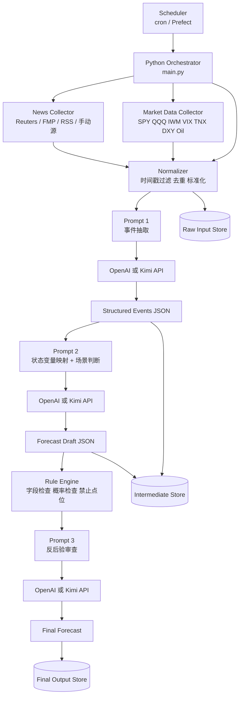

# 用 OpenAI / Kimi API 从 0 到 1 搭建前瞻性美股预测系统：最小实现架构图

如果你的目标是**先把系统跑起来**，而不是一开始就做成完整平台，那么最佳方案不是复杂的多 Agent 集群，而是一套**单服务 orchestrator + 外部数据抓取 + 一个主模型接口 + 一个审查调用 + 本地规则层 + 数据库存档**的最小架构。这个版本已经足够支持你每天自动拉取输入、生成前瞻判断、执行反后验审查，并把过程存档下来。

这里我给你的方案，默认同时兼容 **OpenAI API** 和 **Kimi API**。两者在这个最小架构里扮演的是同一种角色：**推理引擎**。也就是说，它们并不是整个平台本身，而是平台中的核心模型层。真正的平台骨架，仍然应该由你自己的 Python 服务来控制。

## 一、最小架构的核心思想

从 0 到 1 阶段，你不应该追求“最强”，而应该追求“最少组件就能形成闭环”。所谓闭环，是指系统至少能完成五件事：第一，拉取新闻和市场指标；第二，把输入清洗成结构化内容；第三，调用模型输出前瞻判断；第四，再调用一次模型或规则层做反后验审查；第五，把全部输入、输出和中间结果存档。

这意味着，最小实现架构只需要六个组件：**调度入口、数据采集层、标准化层、LLM 推理层、规则/审查层、存储层**。只要这六层连起来，你的系统就已经具备研究价值。

| 组件 | 是否必须 | 作用 | 最小实现建议 |
|---|---|---|---|
| Scheduler | 必须 | 每天定时触发 | cron / Prefect 简单 flow |
| Python Orchestrator | 必须 | 串联全部步骤 | 一个 Python 主程序 |
| Data Collectors | 必须 | 拉新闻和市场数据 | requests + API 接口 |
| LLM Client | 必须 | 调 OpenAI/Kimi 完成分析 | OpenAI SDK 兼容接口 |
| Rule / Audit Layer | 必须 | 检查后验偏差与格式 | Python 校验 + 二次模型审查 |
| Storage | 必须 | 保存输入和结果 | SQLite / PostgreSQL |

## 二、最小架构图

下面这张图，就是我建议你第一阶段直接照着搭的版本。



## 三、数据流应该怎么走

这个最小架构里，最重要的不是“模型调了几次”，而是**数据流顺序不能乱**。你应当坚持一条原则：**原始输入先进入标准化层，再进入事件抽取，再进入状态变量与场景判断，最后才进入预测和审查。**

也就是说，最终预测模块不应直接读取杂乱新闻原文，而是只读取已经结构化好的事件与状态变量。这样做的好处，是可以明显减少模型被新闻叙事带偏，也能降低后验性语言混入最终结论的概率。

## 四、最小目录结构

从工程角度看，你完全不需要一开始就搞成微服务。一个清晰的 Python 项目目录已经够用。下面是一套很适合第一阶段的目录结构。

```text
us-equity-forecast/
├── app/
│   ├── main.py
│   ├── config.py
│   ├── scheduler.py
│   ├── llm_client.py
│   ├── collectors/
│   │   ├── news.py
│   │   └── market_data.py
│   ├── pipeline/
│   │   ├── normalize.py
│   │   ├── extract_events.py
│   │   ├── map_states.py
│   │   ├── generate_forecast.py
│   │   └── review_forecast.py
│   ├── rules/
│   │   ├── schema_check.py
│   │   ├── anti_hindsight.py
│   │   └── validators.py
│   └── storage/
│       ├── db.py
│       └── models.py
├── prompts/
│   ├── event_extraction.txt
│   ├── state_mapping.txt
│   ├── forecast.txt
│   └── anti_hindsight_review.txt
├── data/
│   ├── raw/
│   ├── intermediate/
│   └── final/
├── requirements.txt
└── README.md
```

## 五、最小调用链应该怎么拆

在最小实现里，我建议你把模型调用固定成**三次**，不要更多。这样最容易控成本，也最容易调试。

第一次调用，只做**事件抽取**。输入是新闻与市场快照，输出是结构化事件 JSON。第二次调用，只做**状态变量映射 + 市场场景判断 + 预测草稿**。第三次调用，只做**反后验审查与改写**。在这三次调用之间，所有中间结果都必须落盘。

| 调用次数 | 任务 | 输入 | 输出 |
|---|---|---|---|
| Call 1 | 事件抽取 | 原始新闻 + 指标快照 | Structured Events |
| Call 2 | 状态映射与预测草稿 | Structured Events | Forecast Draft |
| Call 3 | 反后验审查 | Forecast Draft + 规则检查结果 | Final Forecast |

## 六、OpenAI 和 Kimi 在这个架构里怎么切换

你完全可以把 OpenAI 和 Kimi 做成统一接口，不需要为两套模型写两套系统。最简单的做法，就是在 `llm_client.py` 里封装一个统一方法，例如 `generate_json(task_name, prompt, model_provider)`。当 `model_provider=openai` 时走 OpenAI 接口；当 `model_provider=kimi` 时走 Kimi 的 OpenAI-compatible 接口。

也就是说，你的业务代码里不应该出现大量模型厂商分支。**模型提供商应当是配置，而不是架构。** 这样未来你要加 Claude 或别的模型，也不会破坏主流程。

## 七、最小数据库设计

第一阶段不一定非要上 PostgreSQL。你完全可以用 **SQLite** 起步，只要表结构设计得清楚。建议至少有三张表：`runs`、`artifacts`、`forecasts`。

`runs` 用来记录每次盘前运行的时间、状态和耗时；`artifacts` 用来保存原始输入、中间 JSON 和审查结果路径；`forecasts` 用来保存最终观点、方向倾向、置信度、失效条件和最终文本。这样你后面做复盘时会非常方便。

| 表名 | 作用 | 最低字段 |
|---|---|---|
| runs | 记录一次任务运行 | run_id, run_time, status |
| artifacts | 记录输入与中间结果 | run_id, artifact_type, path |
| forecasts | 记录最终预测 | run_id, bias, confidence, invalidation, summary |

## 八、最小规则层必须检查什么

即使你只做最小版本，规则层也绝对不能省。因为真正帮助你避免后验偏差的，并不只是 Prompt，而是**模型外部的纪律**。

第一，检查最终 JSON 是否字段齐全。第二，检查是否缺少失效条件。第三，检查是否出现“目标点位”“突破某点”“跌破某点”等你明确不允许的表达。第四，检查是否只写了支持证据，没有写反方证据。第五，检查预测窗口是否已声明。只要其中任意一项失败，就不要直接发布结果。

## 九、从 0 到 1 的最短落地顺序

如果你现在就要开始，我建议按下面这个顺序推进，而不是一开始就写很多平台代码。

| 顺序 | 要做的事 | 交付物 |
|---|---|---|
| 1 | 写 4 份 Prompt | prompts/*.txt |
| 2 | 写统一 LLM Client | llm_client.py |
| 3 | 写新闻与市场数据采集器 | collectors/*.py |
| 4 | 写 normalize 流程 | normalize.py |
| 5 | 串起 3 次模型调用 | main.py |
| 6 | 加 schema 与禁用词检查 | rules/*.py |
| 7 | 落 SQLite 存档 | storage/*.py |
| 8 | 用 cron 每天盘前运行 | scheduler.py |

## 十、我给你的最小实现建议

如果你要我给一个最直接的结论，那么第一版就这样做：

> **Python 单仓库 + OpenAI/Kimi API + 三次模型调用 + SQLite 存档 + cron 调度。**

这个组合已经足够让你在一周内做出一个能用的前瞻性美股预测系统原型。它不华丽，但它有一个非常大的优点：**每一步都清楚、每一步都能看、每一步都能改。** 对于你现在的目标来说，这比一开始搞复杂平台要更正确。

## 十一、下一阶段如何升级

当这个最小版本跑稳以后，再做三件升级：第一，把 SQLite 换成 PostgreSQL；第二，把 cron 换成 Prefect 或 Dagster；第三，把最终输出接到一个简单 Web 面板或日报生成器。到这一步，你的系统就从“可运行原型”升级成“轻量生产系统”了。

## 十二、结论

所以，基于 OpenAI / Kimi API 的从 0 到 1 最小架构，并不是“一个超级 Prompt 直接搞定全部任务”，而是：

**一个 Python orchestrator，配合三次模型调用、一个小规则层、一个轻量数据库和一个定时调度器，形成最小闭环。**

这就是我最推荐你现在立刻开始搭的版本。
